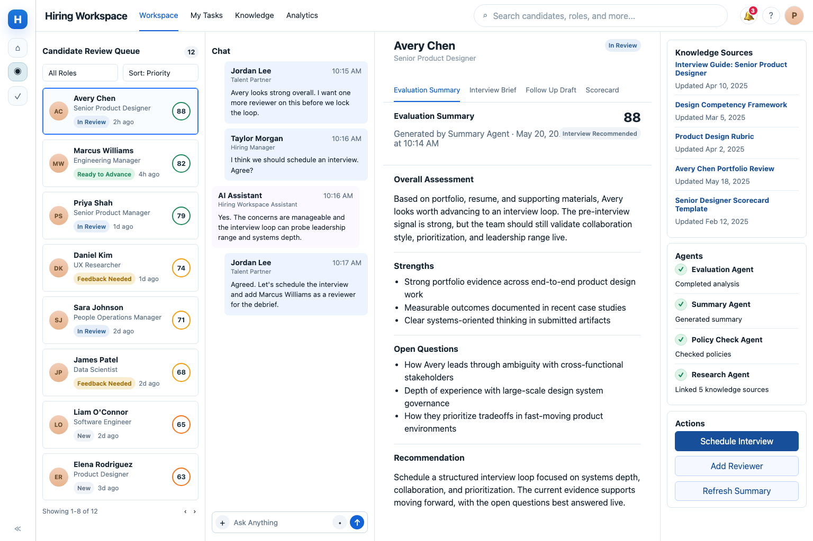

# Agent Workspace

**A metadata-driven React/TypeScript workspace and event-oriented
runtime for long-running human-agent collaboration.**

[](https://github.com/paulbohnenkamp/agent-workspace/actions/workflows/ci.yml)



Agent Workspace explores what an enterprise agent platform needs after
the single-prompt demo: durable projects, reusable capabilities,
resumable work, human review, auditable outcomes, and a UI that is a
projection of the underlying system rather than a second source of
truth.

The repository includes a working React 19 and TypeScript workspace
slice, a reusable component system, metadata-driven view interpretation
and validation, typed platform packages, an event-oriented runtime
model, tests, CI, architecture records, specifications, implementation
plans, and working examples.

> **Project status:** Active development. The architecture, type model,
> repository harness, and React workspace slice are substantial; the
> complete production runtime, persistence, schema enforcement,
> scheduling, and model-provider integrations are still being built.

## What This Repository Demonstrates

### React and TypeScript application architecture

-   React 19 functional components written in TypeScript
-   Reusable layout primitives and higher-level workspace components
-   A typed component registry with duplicate- and unknown-alias
    protection
-   Metadata-driven layouts instead of page-specific rendering
-   Clear separation among loading, projected state, interpretation,
    validation, layout, and rendering
-   Shared interfaces for view definitions, bindings, routes, fields, UI
    state, and resolved view nodes

### Reusable component system

The component registry provides a generic vocabulary that can be reused
across different project views.

| Category | Components |
| --- | --- |
| Layout and shell | `shell`, `panel`, `rail`, `canvas`, `section`, `stack`, `grid`, `toolbar` |
| Content primitives | `card`, `text`, `badge`, `divider`, `list`, `document` |
| Workspace composites | `header`, `queue`, `summaryCard`, `timeline`, `composer`, `tabs`, `sources`, `statusList`, `actions` |

The registry remains deliberately thin. Components live in separate
files under [`src/components`](src/components), while
[`ComponentRegistry.tsx`](src/ComponentRegistry.tsx) handles
registration, lookup, and rendering.

### Metadata-driven UI

Project views declare structure in metadata rather than embedding each
screen in custom React conditionals.

``` text
Project filesystem
        ↓
Package and view loading
        ↓
Typed project model
        ↓
Event-derived state and projections
        ↓
View interpreter
        ↓
Component registry
        ↓
Layout builder
        ↓
React renderer
```

Key implementation points:

-   [`view-loader.ts`](src/view-loader.ts) loads canonical and
    renderer-specific view definitions.
-   [`interpreter.ts`](src/interpreter.ts) resolves route values,
    fields, projected state, bindings, and UI context.
-   [`view-validation.ts`](src/view-validation.ts) validates view
    structure, regions, grid declarations, actions, bindings, and
    component aliases.
-   [`LayoutBuilder.tsx`](src/LayoutBuilder.tsx) turns declared regions
    and tracks into a reusable React layout.
-   [`ComponentRegistry.tsx`](src/ComponentRegistry.tsx) maps generic
    metadata aliases to concrete components.
-   [`render-workspace.tsx`](src/render-workspace.tsx) renders the
    interpreted workspace.

This allows the same rendering infrastructure to support multiple views
without copying screen-specific layout code.

## Working Workspace Example

The hiring project demonstrates three named views over one project
model:

-   **Candidate Review** --- candidate context, evaluation information,
    sources, timeline, and review actions
-   **Open Roles Board** --- project and role information organized
    through reusable workspace components
-   **Approval Queue** --- human-in-the-loop review and status flow

The example is under
[`docs/examples/hiring-project`](docs/examples/hiring-project). Its
filesystem definitions and view metadata are loaded by the same pipeline
used by the React workspace renderer.

## Platform Model

Agent Workspace is project-centric and intentionally layered.

### Collaboration and work

-   **Projects** organize context and participants.
-   **Agents** perform work.
-   **Skills** package reusable know-how.
-   **Channels** receive and send communication.
-   **Schedules** trigger work.
-   **Resources** provide shared context.
-   **Artifacts** preserve versioned outcomes.
-   **Threads** capture human-agent collaboration.
-   **Runs** record execution.

### Integration and capability

-   **Connectors** bind external systems, authentication, and routing.
-   **Tools** expose discrete operations that agents can invoke.

### Runtime records and state

-   **Events** are the canonical record of what happened.
-   **Projections** derive what is true now.
-   **Agent sessions** preserve resumable participation context.

``` text
Project definitions + resources + views
                  ↓
              Package loader
                  ↓
           Typed project model
                  ↓
      Events → projections → workspace
                  ↓
       Runs + threads + artifacts
```

The authoritative architecture is documented in
[`docs/architecture/ARCHITECTURE_V3.md`](docs/architecture/ARCHITECTURE_V3.md).

## TypeScript Packages

The repository is organized as a workspace of focused packages:

  ------------------------------------------------------------------------
  Package                              Responsibility
  ------------------------------------ -----------------------------------
  [`@awp/types`](packages/types)       Shared definitions and runtime
                                       TypeScript types

  [`@awp/schemas`](packages/schemas)   JSON schemas for persisted runtime
                                       records

  [`@awp/loader`](packages/loader)     Filesystem discovery, YAML loading,
                                       registries, and reference
                                       resolution

  [`@awp/tools`](packages/tools)       Tool execution and pluggable
                                       provider boundaries

  [`@awp/runtime`](packages/runtime)   Project execution, events,
                                       repositories, runs, artifacts, and
                                       threads
  ------------------------------------------------------------------------

The code favors stable interfaces, composition, provider patterns,
repository abstractions, and explicit boundaries over deep inheritance
or domain-specific framework code.

## Harness-Engineering Workflow

This repository is also an example of harness engineering: the code is
only one part of the system used to develop the code safely.

``` text
Specification
    ↓
Execution plan
    ↓
Small implementation slice
    ↓
Tests, lint, build, and example verification
    ↓
Documentation and completion notes
    ↓
A stronger repository knowledge base for the next change
```

The workflow is intentionally durable:

1.  [`docs/specs`](docs/specs) defines intended behavior and acceptance
    criteria.
2.  [`plans/index.md`](plans/index.md) is the handoff point for active
    and completed implementation plans.
3.  Each plan records context, scope, implementation steps,
    verification, status, and completion notes.
4.  Changes are made incrementally and verified through tests, linting,
    builds, and working examples.
5.  [`AGENTS.md`](AGENTS.md) preserves architecture rules, naming
    conventions, guardrails, and repository-specific operating
    knowledge.
6.  ADRs explain major architectural decisions and rejected
    alternatives.
7.  Completed work updates the roadmap, examples, and repository
    guidance so later human or AI contributors need less repeated
    explanation.

The goal is cumulative engineering knowledge: later refactors and new
requirements should become faster and more consistent because the
repository itself teaches contributors how the system is intended to
work.

## Engineering Principles

-   **Metadata owns structure.** Views declare composition; renderers
    interpret it.
-   **UI is a projection, not a source of truth.** Filesystem
    definitions and events remain authoritative.
-   **Registry-based composition over one-off pages.**
-   **Reusable components over duplicated feature-specific markup.**
-   **Type-safe boundaries over broad `any` usage.**
-   **Composition over inheritance.**
-   **Configuration over hard-coded domain behavior.**
-   **Incremental, reviewable changes over large rewrites.**
-   **Tests, examples, and documentation are part of the
    implementation.**
-   **Borrow proven patterns before inventing new abstractions.**

The React workspace architecture adapts registry, builder, metadata,
validation, and reusable-component lessons from earlier enterprise
TypeScript/Preact framework work. All code in this repository is an
independent React-first implementation and contains no proprietary
source.

## Quick Start

### Requirements

-   Node.js 18 or later
-   npm

CI currently verifies the repository with Node.js 22.

### Install and verify

``` bash
npm ci
npm run build
npm run lint
npm run build:workspace
npm test
```

### Run the workspace example

``` bash
npm run workspace
```

Then open:

``` text
http://127.0.0.1:4010/
```

The root route redirects to the Candidate Review view. Additional
example routes include:

``` text
/hiring/open-roles-board
/hiring/candidate-review?candidateId=avery-chen
/hiring/approval-queue
```

## Repository Map

``` text
agent-workspace/
├── src/
├── packages/
├── docs/
├── plans/
├── AGENTS.md
├── ROADMAP.md
└── CHANGELOG.md
```

## Current Implementation Status

### Working today

-   Architecture V3 and ADRs
-   Shared TypeScript definition and runtime types
-   Filesystem package loading and specialized registries
-   Basic runtime and repository implementations
-   Event and projection-oriented architecture
-   React workspace renderer
-   Reusable component registry and catalog
-   Metadata-driven fields, regions, bindings, and layouts
-   Multiple named hiring-project views
-   View and component-alias validation
-   Root-level build, lint, test, and workspace-UI verification
-   GitHub Actions CI
-   Specs, execution plans, examples, and completion tracking

### Still in progress

-   Full JSON Schema enforcement across all packages and views
-   Complete runtime behavior aligned with the architecture
-   Rich event replay and projection recovery
-   Production database persistence
-   Complete artifact versioning and publication workflows
-   Real model-provider and agent execution integrations
-   Scheduling, wake-on-event execution, and external channels
-   Broader end-to-end and browser test coverage
-   Production hardening, authorization, observability, and deployment

See [`ROADMAP.md`](ROADMAP.md) for the detailed implementation map and
[`plans/index.md`](plans/index.md) for the current work queue.

## Start Here

-   [`AGENTS.md`](AGENTS.md)
-   [`docs/README.md`](docs/README.md)
-   [`docs/architecture/ARCHITECTURE_V3.md`](docs/architecture/ARCHITECTURE_V3.md)
-   [`docs/examples/hiring-project/README.md`](docs/examples/hiring-project/README.md)
-   [`plans/index.md`](plans/index.md)
-   [`CHANGELOG.md`](CHANGELOG.md)
-   [`docs/releases/README.md`](docs/releases/README.md)

## License

Apache License 2.0. See [`LICENSE`](LICENSE).
