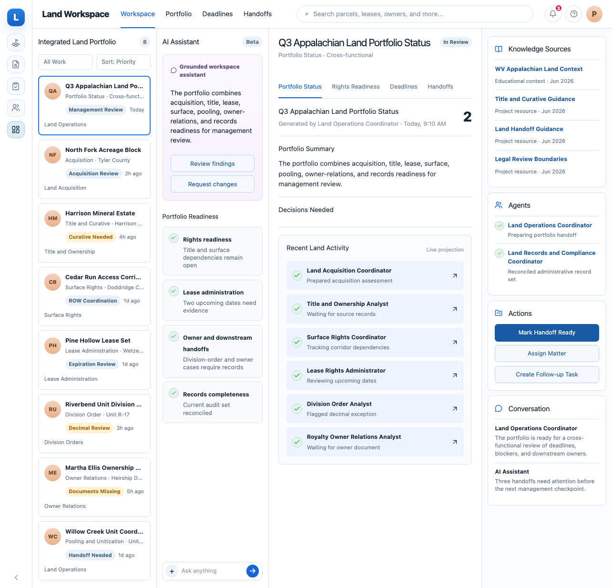

# Land management and land administration project

This example models the land department of a West Virginia-focused oil and gas
company. The department creates, protects, and administers the legal and
commercial rights needed to explore, drill, and produce. It coordinates with
landowners, surface owners, legal teams, operators, accounting, and government
agencies.

The project has two connected tracks:

- **Land management and landman work:** acreage strategy, acquisition, negotiation, title, curative work, pooling and unitization coordination, surface access, and development support.
- **Land administration:** lease records, ownership interests, lease obligations, division orders, royalty-owner cases, records, compliance, and downstream handoffs.

## What it covers

- Acquisition intake and parcel prioritization
- Acreage strategy, lease acquisition, and landowner negotiation
- Ownership and title review with curative follow-up
- Pooling, unitization, and development handoffs
- Lease, mineral-right, surface-use, easement, and right-of-way administration
- Division-order, royalty-owner, title-change, and suspense context
- Records completeness, compliance review, and audit trails
- Long-running work queues with deadlines, handoffs, approvals, and escalation
- Durable artifacts and scheduled reviews
- Metadata-driven workspace views over projected project state

## Agents and shared workspace views

This project has eight specialized land-department agents, but five reusable
workflow views. The views are operational surfaces, not five separate jobs;
multiple agents, human users, and handoffs can use the same view.

| Workspace view | Primary coverage |
| --- | --- |
| Acquisition and Rights Queue | Acquisition, title, lease, surface-rights work |
| Title and Curative Review | Title analyst, acquisition, legal/title reviewers |
| Lease Administration Queue | Lease-rights administration and records |
| Division Orders and Owner Relations | Division orders, royalty owners, title changes |
| Integrated Land Portfolio | Operations, development handoffs, management status |

The workspace follows the composition used by the other examples: a work
queue, an AI Assistant column, a central artifact or primary work surface, and
context panels for Knowledge Sources, Agents, and Actions.

## Architecture V3 mapping

The project is a normal V3 filesystem package. Agents perform work, skills provide reusable know-how, tools describe capabilities, resources provide shared context, artifacts preserve outcomes, and schedules trigger reviews. Threads, runs, events, and projections are runtime records and are not pre-created as domain definitions.

The example intentionally does not introduce a pack layer. DecisionForge's oil-and-gas materials informed selected domain vocabulary and workflows, but the package layout follows this repository's architecture.

## Connected workflow and handoffs

1. A prospective acreage opportunity enters the acquisition queue. The land-acquisition coordinator records the business purpose, parcel context, requested rights, owner outreach, negotiation facts, approvals, and open decisions.
2. The title-and-ownership analyst receives the acquisition matter and source documents, then returns a source-linked title examination and curative action plan. Questions about title, heirship, enforceability, or local law go to qualified professionals.
3. The lease-rights administrator records executed leases, assignments, amendments, obligations, expiration dates, continuation evidence, and related surface or right-of-way instruments. This is the handoff from negotiated rights to an auditable administrative record.
4. The surface-rights and land-operations coordinators connect access, roads, pipelines, water, easements, pooling/unitization, development readiness, and agency coordination. Their handoff identifies the relevant artifacts, dependencies, deadlines, blockers, and accountable downstream team.
5. The division-order analyst uses supplied title, lease, unit, and interest records to flag decimal, signature, effective-date, and ownership inconsistencies. The royalty-owner relations analyst manages inquiries, transfers, death/heirship documentation, communication history, suspense context, and handoffs without deciding payment or legal entitlement.
6. The records/compliance coordinator reconciles the land-management and land-administration records, recording status, approvals, evidence, exceptions, and retention needs. It reports gaps; it does not declare legal or regulatory compliance without verified requirements.
7. Agents produce versioned artifacts, events, runs, and threads through the runtime. Work pauses for missing information, approval, legal review, accounting review, or another external handoff rather than silently resolving uncertainty.

The five views expose these handoffs as reusable workspace metadata: acquisition and rights intake, title/curative review, lease administration, division-order/owner relations, and the integrated land portfolio.

All examples are hypothetical. Lease language, local law, agency requirements, and legal counsel control real decisions.
