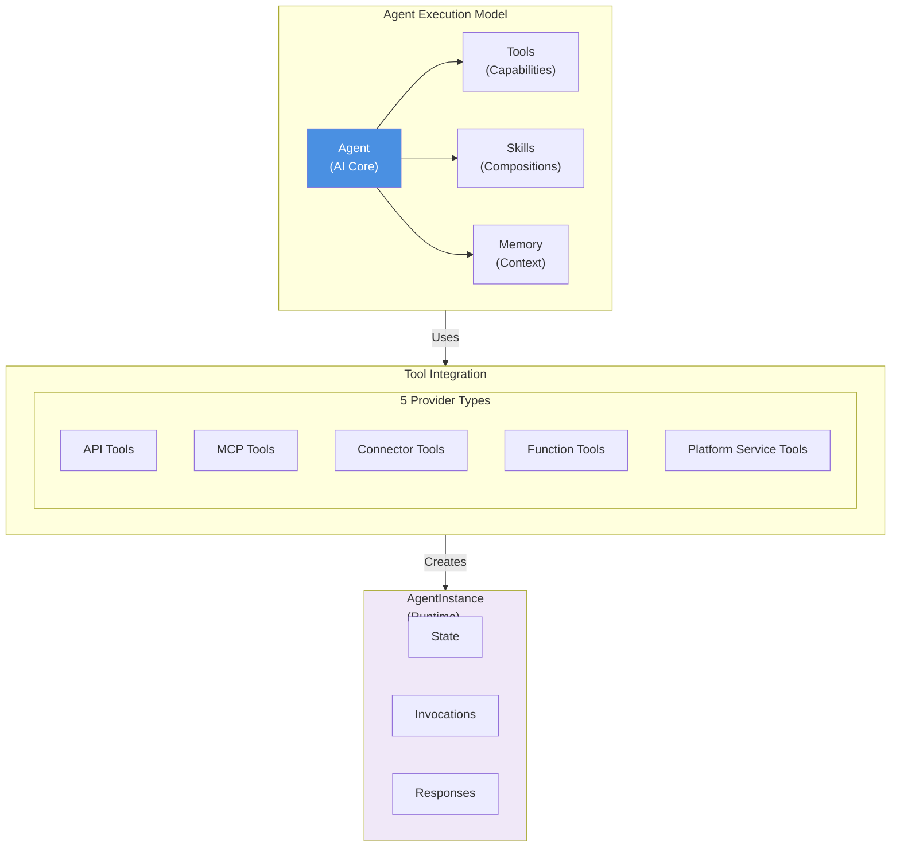

# Agent Runtime Architecture

**Key Concepts:**

- **Agent**: AI core with model, instructions, role
- **Tools**: 5 provider types (API, MCP, Connector, Function, Service)
- **Skills**: Compositions of tools and other skills
- **AgentInstance**: Runtime execution record
- **Invocations**: Each agent call tracked and versioned

