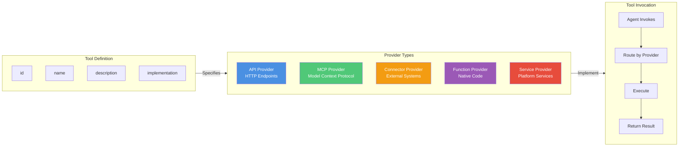

# Tool Provider Model

**Key Concepts:**

- **5 Provider Types**: Abstract backing mechanisms
- **Tool Providers**: Uniform interface, different backends
- **Routing**: Framework handles provider-specific details
- **Abstraction**: Agents don't know provider type
- **Extensibility**: Add new providers without changing agent code

