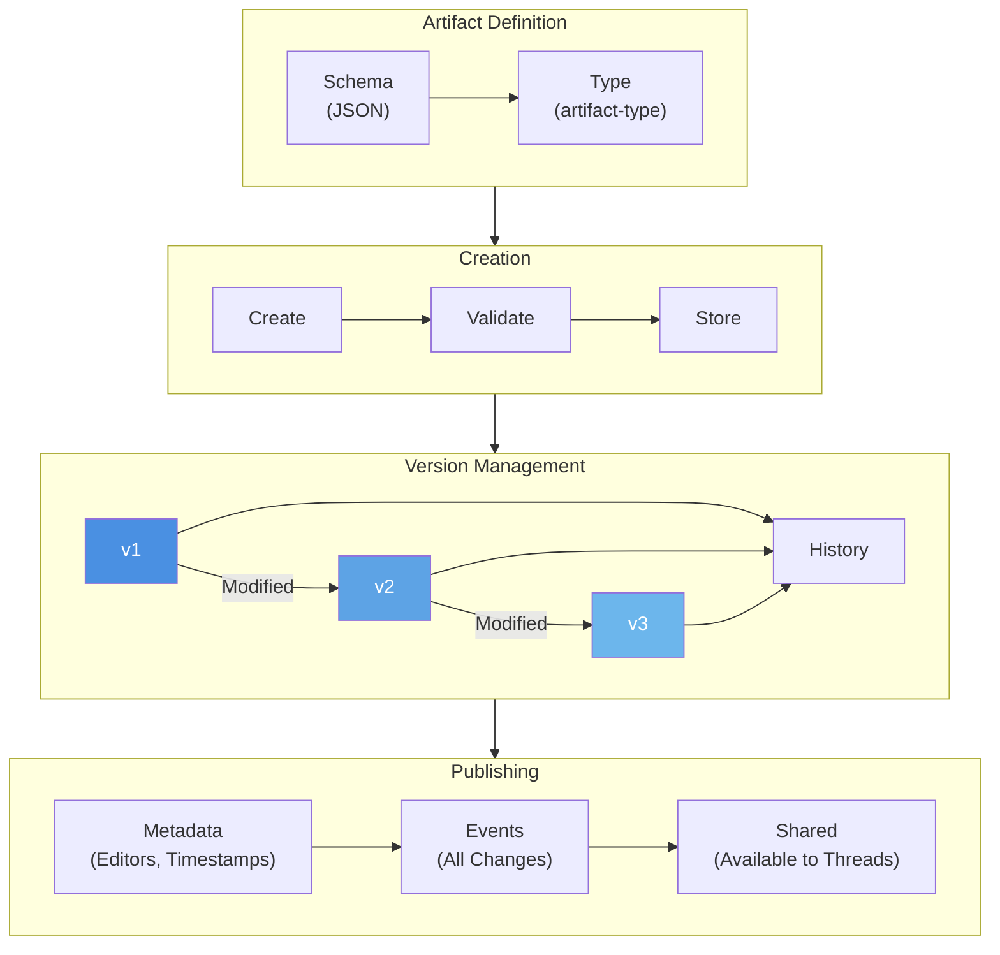

# Artifact Lifecycle and Versioning

**Key Concepts:**

- **Schema**: Defines artifact structure
- **Versioning**: Full history, never overwrite
- **Metadata**: Track editors, timestamps, source
- **Events**: All modifications recorded
- **Publishing**: Makes artifact available to threads

