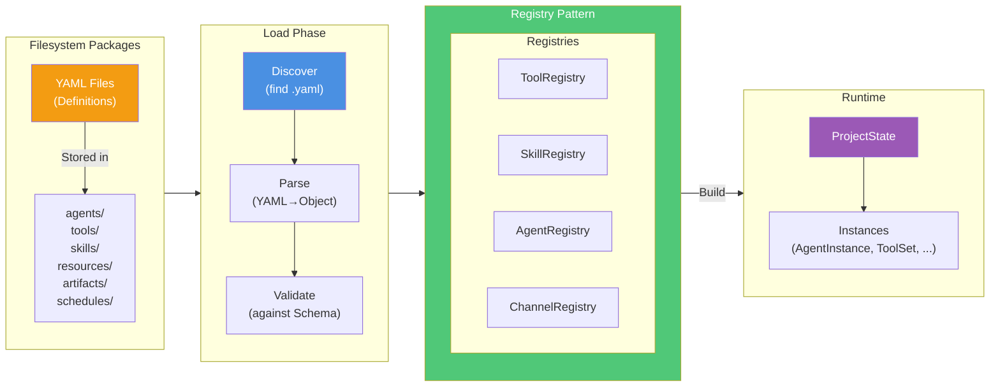

# Package Loading and Registry Pattern

**Key Concepts:**

- **Package-First**: YAML files are source of truth
- **Discovery**: Automatic package discovery
- **Parsing**: Transform YAML to objects
- **Registry**: Index all packages by ID
- **Runtime**: Resolved instances from registered packages

