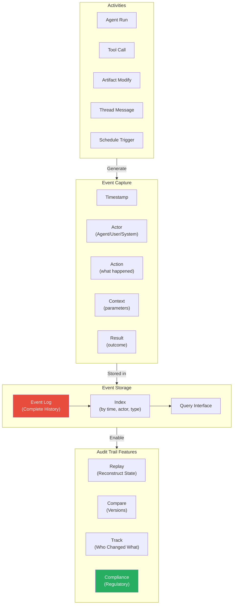

# Event Audit Trail and Logging

**Key Concepts:**

- **Complete Audit Trail**: Every action recorded
- **Event Structure**: Timestamp, actor, action, context, result
- **Immutable History**: Events never deleted, only appended
- **Queryable**: Search by time, actor, type
- **Compliance**: Regulatory requirements met through audit trail

